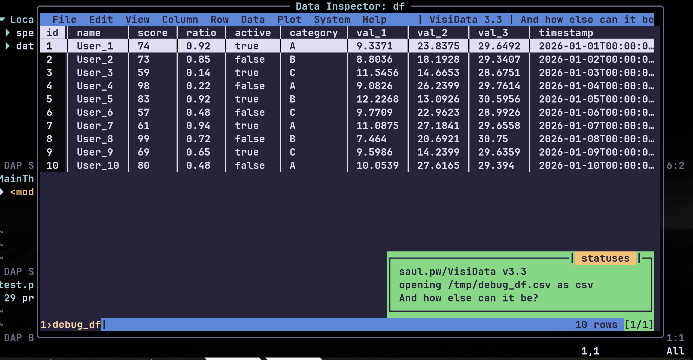

#### Neovim Config

Welcome to my nvim config!

#### General

- This is a basic Neovim setup with a few plugins.  
   - For a detailed plugin overview, look into `lua/plugins`.
- My convenient keymaps.
- Zellij is used as the terminal emulator.
- Contains also some keybindings i use in vscode, look into `.vscode/`
- Debugging setup for Python, which is a bit specific:  
   - It uses visidata to inspect DataFrames.  
   - For example, when debugging, hovering over a DataFrame and clicking `dv` opens visidata with the DataFrame.
    

#### Requirements

- Neovim 0.11+
- visidata installed (install it with `pipx` or otherwise)
- Generally speaking, this is based on [kickstart.nvim](https://github.com/nvim-lua/kickstart.nvim); follow the installation guide there.
- Other requirements will be added if I don't forget to add them...

#### Credits
 - Setup based on https://github.com/hendrikmi/neovim-kickstart-config
